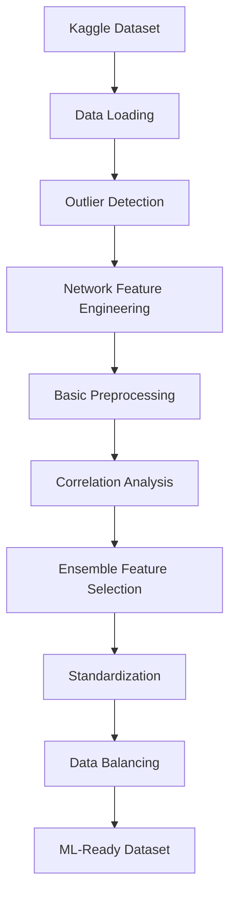

# DDoS Detection System 🛡️

A comprehensive machine learning system for detecting Distributed Denial of Service (DDoS) attacks using network intrusion data. This project implements advanced preprocessing techniques, domain-specific feature engineering, and ensemble feature selection methods to build an effective DDoS detection pipeline.

## 📋 Table of Contents

- [Overview](#overview)
- [Features](#features)
- [Project Structure](#project-structure)
- [Installation](#installation)
- [Usage](#usage)
- [Technical Architecture](#technical-architecture)
- [Data Pipeline](#data-pipeline)
- [Improvements Implemented](#improvements-implemented)
- [Functions Documentation](#functions-documentation)
- [Dependencies](#dependencies)
- [Dataset Information](#dataset-information)

## 🎯 Overview

This DDoS detection system processes network traffic data to identify malicious activities using machine learning techniques. The system:

- Downloads network intrusion datasets from Kaggle
- Applies advanced preprocessing including outlier detection and domain-specific feature engineering
- Uses ensemble feature selection methods for optimal feature identification
- Implements data balancing and standardization for ML model preparation

## 🚀 Features

### Core Capabilities

- ✅ **Automated Data Download**: Downloads network intrusion dataset from Kaggle
- ✅ **Multi-file Processing**: Combines multiple CSV files into unified dataset
- ✅ **Advanced Preprocessing**: Outlier detection, missing value handling, data cleaning
- ✅ **Network Feature Engineering**: Domain-specific features for network traffic analysis
- ✅ **Correlation Analysis**: Removes redundant features to improve model performance
- ✅ **Ensemble Feature Selection**: Combines multiple selection methods for robust feature identification
- ✅ **Data Balancing**: Handles class imbalance between benign and attack samples
- ✅ **Standardization**: Prepares data for machine learning algorithms

### Enhanced Improvements

- 🔍 **Outlier Detection & Handling**: IQR-based detection with intelligent capping
- 🌐 **Network-Specific Features**: Rate calculations, flow asymmetry, port classifications
- 🔗 **Correlation Analysis**: Removes highly correlated features (>95% threshold)
- 🧠 **Ensemble Feature Selection**: F-test + Mutual Information + Tree-based importance

## 📁 Project Structure

```
ddos-detection/
├── main.py              # Main implementation file
├── requirements.txt     # Python dependencies
├── README.md           # Project documentation
├── venv/               # Virtual environment
└── .gitignore          # Git ignore rules
```

## 🛠️ Installation

### Prerequisites

- Python 3.7+
- Kaggle API credentials

### Setup Steps

1. **Clone the repository**:

   ```bash
   git clone <repository-url>
   cd ddos-detection
   ```

2. **Activate virtual environment**:

   ```bash
   source venv/bin/activate  # On macOS/Linux
   # or
   venv\Scripts\activate     # On Windows
   ```

3. **Install dependencies**:

   ```bash
   pip install -r requirements.txt
   ```

4. **Configure Kaggle API**:
   - Go to [Kaggle Account Settings](https://www.kaggle.com/account)
   - Click "Create New API Token"
   - Download `kaggle.json`
   - Place in `~/.kaggle/` directory
   - Set permissions: `chmod 600 ~/.kaggle/kaggle.json`

## 🚀 Usage

Run the complete DDoS detection pipeline:

```bash
python main.py
```

The system will automatically:

1. Download the network intrusion dataset from Kaggle
2. Process and combine multiple CSV files
3. Apply enhanced preprocessing and feature engineering
4. Perform feature selection and data balancing
5. Output processed dataset ready for model training

## 🏗️ Technical Architecture

### Data Flow Pipeline



### Processing Stages

| Stage                    | Function                       | Purpose                                         |
| ------------------------ | ------------------------------ | ----------------------------------------------- |
| **Data Acquisition**     | `load_dataset()`               | Downloads and combines CSV files                |
| **Outlier Handling**     | `detect_and_handle_outliers()` | Detects and caps extreme values                 |
| **Feature Engineering**  | `create_network_features()`    | Creates domain-specific features                |
| **Correlation Analysis** | `remove_correlated_features()` | Removes redundant features                      |
| **Feature Selection**    | `feature_selection()`          | Selects optimal features using ensemble methods |
| **Data Preparation**     | `standardize_data()`           | Standardizes and balances dataset               |

## 🔧 Improvements Implemented

### 1. 🔍 Outlier Detection & Handling

**Problem**: Network traffic data contains extreme values that can skew model performance.

**Solution**:

- IQR-based outlier detection
- Intelligent capping instead of removal
- Detailed outlier statistics

```python
# Detects outliers using Interquartile Range
Q1, Q3 = df[col].quantile([0.25, 0.75])
IQR = Q3 - Q1
lower_bound = Q1 - 1.5 * IQR
upper_bound = Q3 + 1.5 * IQR
```

**Benefits**:

- Preserves data integrity
- Handles attack-related extreme values
- Provides transparency with outlier statistics

### 2. 🌐 Network Feature Engineering

**Problem**: Raw network data lacks domain-specific insights.

**Solution**: Creates network security-focused features:

- **Rate Features**: `bytes_per_duration`, `packets_per_second`
- **Ratio Features**: `forward_to_backward_ratio`
- **Flow Asymmetry**: `(fwd_sum - bwd_sum) / (fwd_sum + bwd_sum)`
- **Port Classifications**: `is_wellknown_port`, `is_registered_port`, `is_dynamic_port`
- **Statistical Aggregations**: `fwd_total_activity`, `bwd_mean_activity`

**Benefits**:

- Leverages domain expertise
- Captures attack patterns better
- Improves model discriminative power

### 3. 🔗 Correlation Analysis

**Problem**: Network features are often highly correlated, leading to redundancy.

**Solution**:

- Calculates correlation matrix
- Removes features with >95% correlation
- Provides detailed correlation analysis

```python
# Remove highly correlated features
corr_matrix = X.corr().abs()
to_drop = [features with correlation > 0.95]
```

**Benefits**:

- Reduces feature redundancy
- Improves model performance
- Decreases computational complexity

### 4. 🧠 Ensemble Feature Selection

**Problem**: Single feature selection method may miss important patterns.

**Solution**: Combines three methods:

- **F-test** (40% weight): Statistical significance
- **Mutual Information** (30% weight): Non-linear relationships
- **Tree Importance** (30% weight): Feature importance from Random Forest

```python
ensemble_scores = 0.4 * f_scores + 0.3 * mi_scores + 0.3 * tree_scores
```

**Benefits**:

- More robust feature selection
- Captures different types of relationships
- Reduces selection bias

## 📚 Functions Documentation

### Core Functions

#### `load_dataset(dataset_path)`

**Purpose**: Loads and combines multiple CSV files from Kaggle dataset.

**Parameters**:

- `dataset_path`: Path to downloaded dataset directory

**Returns**:

- `combined_df`: Combined DataFrame from all CSV files
- `file_info`: Metadata about each file (shape, labels)

**Features**:

- Handles multiple CSV files automatically
- Provides detailed file information
- Error handling for corrupted files

#### `detect_and_handle_outliers(df, method='iqr', action='cap')`

**Purpose**: Detects and handles outliers in numeric columns.

**Parameters**:

- `df`: Input DataFrame
- `method`: Detection method ('iqr' or 'zscore')
- `action`: Handling method ('cap' or 'remove')

**Returns**:

- `df`: DataFrame with outliers handled
- `outlier_stats`: Dictionary with outlier statistics

**Algorithm**:

```python
# IQR Method
Q1 = df[col].quantile(0.25)
Q3 = df[col].quantile(0.75)
IQR = Q3 - Q1
lower_bound = Q1 - 1.5 * IQR
upper_bound = Q3 + 1.5 * IQR
```

#### `create_network_features(df)`

**Purpose**: Creates domain-specific features for network intrusion detection.

**Generated Features**:

- **Rate Features**: Calculates rates per duration
- **Ratio Features**: Creates ratios between related metrics
- **Flow Features**: Aggregates forward/backward traffic
- **Port Features**: Classifies port types
- **Asymmetry Features**: Measures traffic imbalance

**Returns**:

- `df`: DataFrame with additional network features

#### `remove_correlated_features(X, correlation_threshold=0.95)`

**Purpose**: Removes highly correlated features to reduce redundancy.

**Parameters**:

- `X`: Feature matrix
- `correlation_threshold`: Correlation threshold for removal

**Returns**:

- `X_reduced`: DataFrame with correlated features removed
- `to_drop`: List of dropped feature names

**Algorithm**:

```python
# Calculate correlation matrix
corr_matrix = X.corr().abs()
# Find features above threshold
high_corr_pairs = [(feat1, feat2, corr) for corr > threshold]
```

#### `feature_selection(processed_data, n_features=30)`

**Purpose**: Selects optimal features using ensemble approach.

**Methods Used**:

1. **Variance Filtering**: Removes zero-variance features
2. **F-test**: Statistical significance testing
3. **Mutual Information**: Non-linear relationship detection
4. **Tree Importance**: Feature importance from Random Forest

**Returns**:

- `X_selected`: Selected feature matrix
- `selected_features`: List of selected feature names
- `y`: Target variable

**Ensemble Formula**:

```python
ensemble_scores = 0.4 * f_scores_norm + 0.3 * mi_scores_norm + 0.3 * tree_scores_norm
```

#### `standardize_data(X, y, balance_method="undersample", random_state=42)`

**Purpose**: Standardizes features and balances class distribution.

**Parameters**:

- `X`: Feature matrix
- `y`: Target variable
- `balance_method`: "undersample" or "oversample"
- `random_state`: Random seed for reproducibility

**Returns**:

- `X_balanced`: Standardized and balanced feature matrix
- `y_balanced`: Balanced target variable
- `scaler`: Fitted StandardScaler object

**Process**:

1. Standardization using StandardScaler
2. Class separation (BENIGN vs ATTACK)
3. Balancing based on chosen method
4. Data shuffling for randomization

## 📦 Dependencies

### Core Libraries

```python
import kagglehub              # Kaggle dataset download
import pandas as pd           # Data manipulation
import numpy as np            # Numerical operations
import matplotlib.pyplot as plt  # Basic plotting
import seaborn as sns         # Statistical visualization
```

### Machine Learning

```python
from sklearn.model_selection import train_test_split
from sklearn.preprocessing import StandardScaler
from sklearn.ensemble import RandomForestClassifier
from sklearn.tree import DecisionTreeClassifier
from sklearn.linear_model import LogisticRegression
from sklearn.neighbors import KNeighborsClassifier
from sklearn.naive_bayes import GaussianNB
from sklearn.feature_selection import SelectKBest, f_classif, mutual_info_classif
from sklearn.feature_selection import VarianceThreshold
from sklearn.metrics import accuracy_score, precision_score, recall_score, f1_score
from sklearn.metrics import confusion_matrix, classification_report
from sklearn.utils import resample
```

### Installation Command

```bash
pip install kagglehub pandas numpy matplotlib seaborn scikit-learn
```

## 📊 Dataset Information

**Source**: [Network Intrusion Dataset](https://www.kaggle.com/datasets/chethuhn/network-intrusion-dataset) from Kaggle

**Dataset Composition**:

- **8 CSV files** representing different attack scenarios
- **~2.8M total records** across all files
- **79 features** per record
- **Labels**: BENIGN (normal traffic) vs various attack types

**Files Included**:

1. `Monday-WorkingHours.pcap_ISCX.csv` - Normal traffic
2. `Tuesday-WorkingHours.pcap_ISCX.csv` - Normal traffic
3. `Wednesday-workingHours.pcap_ISCX.csv` - Normal traffic
4. `Thursday-WorkingHours-Morning-WebAttacks.pcap_ISCX.csv` - Web attacks
5. `Thursday-WorkingHours-Afternoon-Infilteration.pcap_ISCX.csv` - Infiltration
6. `Friday-WorkingHours-Morning.pcap_ISCX.csv` - Normal traffic
7. `Friday-WorkingHours-Afternoon-PortScan.pcap_ISCX.csv` - Port scan attacks
8. `Friday-WorkingHours-Afternoon-DDos.pcap_ISCX.csv` - DDoS attacks

**Feature Categories**:

- **Flow Features**: Duration, packets, bytes
- **Forward/Backward Traffic**: Directional traffic analysis
- **Packet Size**: Length statistics (min, max, mean, std)
- **Flow Rates**: Packets/second, bytes/second
- **Flag Counts**: TCP flag statistics
- **Timing Features**: Inter-arrival times, active/idle times

## 🎯 Current Status

✅ **Completed**:

- Data acquisition and loading pipeline
- Advanced preprocessing with outlier detection
- Network-specific feature engineering
- Correlation analysis and redundancy removal
- Ensemble feature selection implementation
- Data standardization and balancing
- Comprehensive bug fixes

🔄 **In Progress**:

- Large-scale data processing (currently running)

⏳ **Next Steps**:

- Model training and evaluation
- Performance metrics calculation
- Cross-validation implementation
- Model comparison and selection

## 🤝 Contributing

To contribute to this project:

1. Fork the repository
2. Create a feature branch
3. Implement improvements
4. Add documentation
5. Submit a pull request

## 📄 License

This project is licensed under the MIT License - see the LICENSE file for details.

---

**Built with ❤️ for network security and machine learning**
